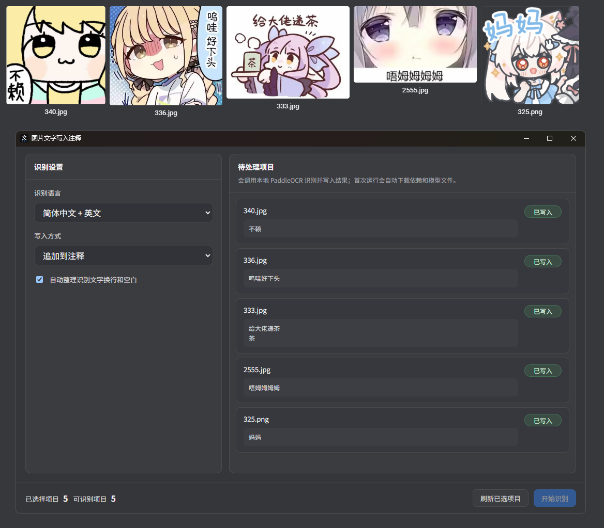

# 图片文字写入注释

用于 Eagle 的本地 OCR 插件。它可以识别当前选中图片中的文字，并将识别结果批量写入图片注释或文件名。


## 功能特性

- 批量识别 Eagle 当前选中图片中的文字
- 支持 `简体中文 + 英文`、`仅简体中文`、`仅英文`
- 支持写入到注释或文件名
- 支持多种写入方式：
  - 追加到注释
  - 覆盖注释
  - 仅注释为空时写入
  - 写入文件名
  - 追加到文件名
- 支持批量处理和结果预览
- 使用本地 `PaddleOCR`，识别完成后可离线使用
- 插件目录保持精简，运行时依赖不会回写到插件目录

## 适用场景

- 为梗图、表情包、截图批量提取文字
- 将图片中的文案写入 Eagle 注释，方便后续搜索
- 把识别出的标题直接写入文件名或追加到文件名

## 安装方式

1. 从 GitHub Releases 下载最新的 `.eagleplugin` 安装包。
2. 在 Eagle 中导入并安装插件。
3. 第一次启动插件时，程序会自动准备本地 OCR 运行环境。

## 首次启动说明

- Windows 下无需预装 Python。
- 第一次启动时，插件会自动下载：
  - Python 运行环境
  - PaddleOCR 依赖
  - OCR 模型文件
- 首次初始化需要联网，通常需要几分钟。
- 初始化完成后，后续识别可直接使用。
- 运行时依赖会下载到本机缓存目录，不会写回插件目录，因此重新打包插件时不会因为本地依赖而变大。

## 使用方法

1. 在 Eagle 中选中需要识别的图片。
2. 打开插件。
3. 选择识别语言。
4. 选择写入方式。
5. 点击“开始识别”。
6. 插件会将识别结果写入注释或文件名。

## 写入方式说明

### 注释写入

- `追加到注释`：将识别结果追加到现有注释末尾
- `覆盖注释`：直接用识别结果替换现有注释
- `仅注释为空时写入`：只有当前注释为空才写入

### 文件名写入

- `写入文件名`：直接使用识别结果作为文件名
- `追加到文件名`：将识别结果追加到当前文件名后

文件名模式下，插件会自动清理换行和非法字符，避免生成无效文件名。

## 兼容性说明

- 当前自动下载 Python 运行环境的流程主要面向 Windows。
- Windows 下可直接开箱使用。
- 其他系统如果本机已有可用 Python 环境，理论上也可继续运行；但当前最佳支持平台仍然是 Windows。

## 技术实现

当前插件采用下面这条链路：

```text
Eagle Plugin UI
  -> js/plugin.js
  -> python/bootstrap_paddle_runtime.py
  -> python/paddle_ocr_runner.py
  -> local runtime cache
  -> PaddleOCR PP-OCRv5 mobile
```

## 项目结构

```text
image-text-to-annotation/
├─ index.html
├─ manifest.json
├─ logo.png
├─ js/
├─ styles/
└─ python/
   ├─ bootstrap_paddle_runtime.py
   └─ paddle_ocr_runner.py
```

## 注意事项

- 首次初始化依赖时需要网络连接。
- 对梗图、手写体、极端压缩图，OCR 仍可能出现误识别。
- 文件名写入模式会自动处理非法字符，但仍建议先用少量图片测试后再大批量使用。

## 项目地址

https://github.com/befoer/eagle-plugin-image-text-to-annotation
